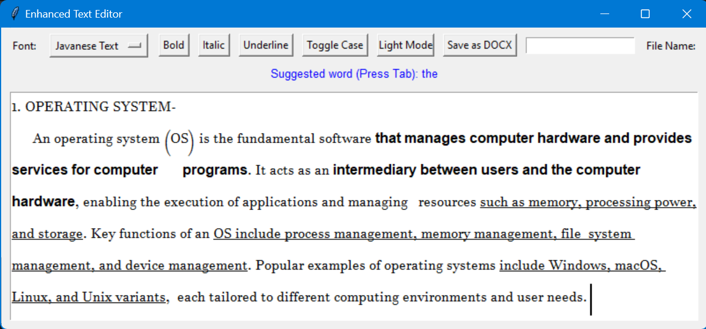
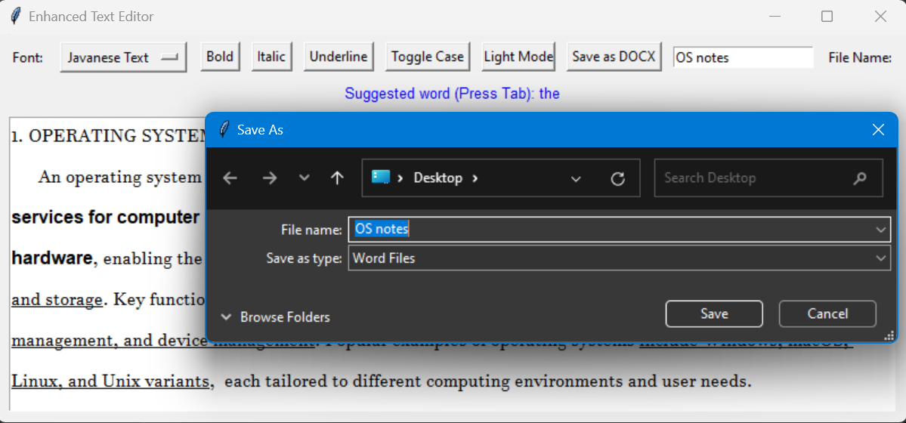
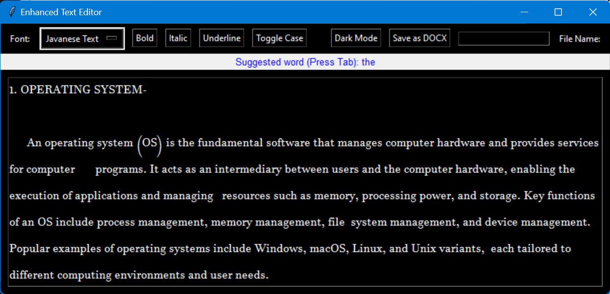

Here’s an alternative README file for your project:  

---

# Advanced Text Editor with AI-Powered Word Prediction  

## Overview  
This project is a modern text editor enhanced with AI-based word prediction capabilities. Built with Python and Tkinter, it combines rich text editing features with predictive text technology, offering a seamless writing experience for users.  

### Normal Interface
 
### Saving The File(.docx)
 


## Key Features  
### 1. **Text Formatting**  
- Bold, Italic, and Underline support.  
- Text case toggling (Uppercase, Lowercase).  
- Intuitive formatting toolbar for quick access.  

### 2. **Word Prediction**  
- Real-time next-word prediction using an AI model.  
- Suggestion bar with contextually relevant predictions.  

### 3. **Customization**  
- Font selection for personalization.  
- Light and Dark modes for better readability and comfort.  

### 4. **File Export**  
- Save your work in `.docx` format with proper text formatting.  

## Installation  
### Prerequisites  
- **Python 3.x** installed on your machine.  
- Required Python libraries:  
  ```bash  
  pip install tensorflow numpy regex python-docx  
  ```  

### Steps to Run  
1. Clone the repository:  

2. Place the pre-trained model (`Next_Word_Prediction_with_Deep_Learning_in_NLP.keras`) in the project folder.  

3. Launch the editor:  

## How It Works  
- **Real-time Prediction**: Start typing in the editor, and suggested next words will appear in a suggestion bar. Press `Tab` to auto-complete a suggestion.  
- **Rich Text Editing**: Use the toolbar for text styling and case transformations.  
- **Theme Toggle**: Switch between light and dark themes as per your preference.  

## Training the AI Model  
The word prediction feature is powered by a Long Short-Term Memory (LSTM) model. The training script is included in the repository for users who want to retrain or fine-tune the model with their own datasets.  

## Screenshots  
### Light Mode  
  
### Dark Mode  
  

## Contributions  
Contributions are welcome! Fork the repository and submit a pull request for any feature additions or bug fixes.  

## License  
Licensed under the MIT License.  

---